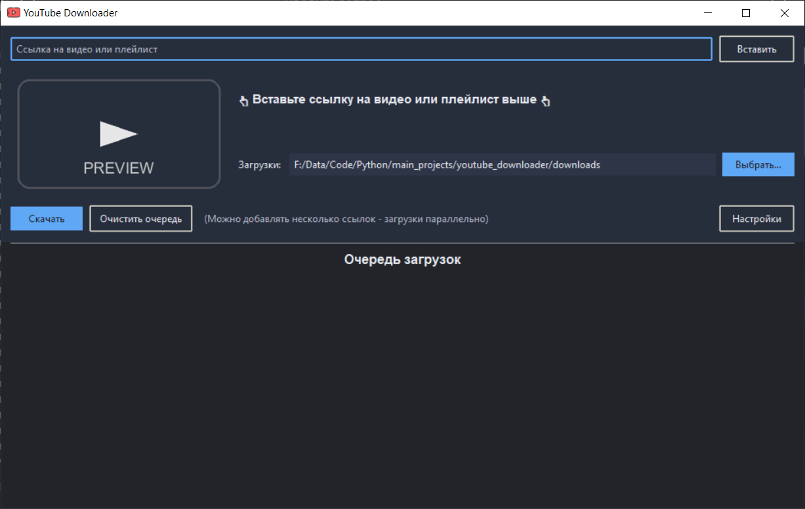
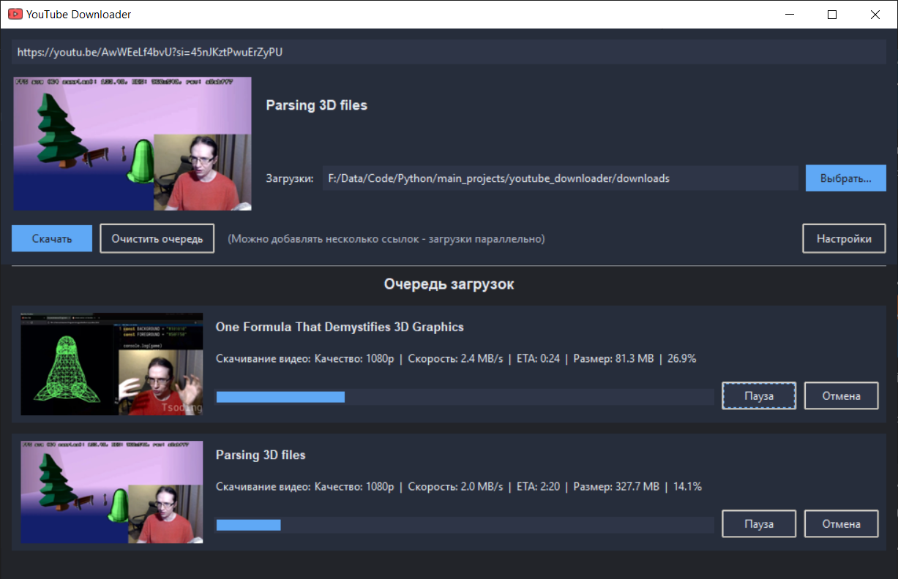

# YouTube Downloader

Простое приложение для скачивания видео и плейлистов с YouTube.

## Скриншоты






## Что умеет

- Скачивание одиночных видео и плейлистов (пачками, без перегруза).
- Параллельные загрузки, пауза/отмена/удаление.
- Темная тема, собственные диалоги и превью.
- Настройка папки загрузки и cookies; режим максимального качества.

## Установка

```bash
git clone https://github.com/Laynholt/youtube_downloader.git
```

```bash
cd youtube_downloader
```

```bash
uv sync
```

```bash
uv run main.py
```

## Как пользоваться

1. Вставьте ссылку на видео или плейлист, нажмите Enter или «Скачать».
2. При желании выберите папку или задайте cookies/макс. качество в «Настройки».
3. Следите за прогрессом в очереди; можно ставить на паузу или удалять задачи.
